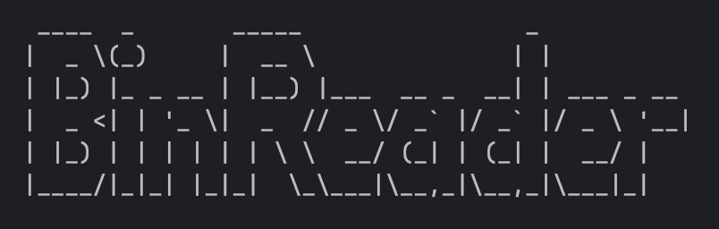

# Bin Reader



A Go-based CLI tool to read and analyze `.bin` files.

---

## Installation

1. Install Go: [golang.org/dl/](https://golang.org/dl/)
2. Clone this repository:
   ```bash
   git clone https://github.com/StealthMoud/BinReader.git
   cd bin-reader
   ```
3. Install dependencies:
   ```bash
   go get github.com/fatih/color
   ```
4. Build the tool:
   ```bash
   go build -o bin-reader
   ```

---

## Usage

```bash
./bin-reader --file path/to/file.bin [options]
# or
./bin-reader -f path/to/file.bin [options]
```

### Options

- `--file`, `-f`: Path to the `.bin` file (required)
- `--verbose`, `-v`: Show detailed output (file size, raw bytes)
- `--output`, `-o`: Save output to a file
- `--max-size`, `-m`: Maximum file size in bytes (default: 10MB)
- `--hex`, `-x`: Display file content as a hex dump
- `--metadata`, `-d`: Show file metadata (name, size, times)
- `--search`, `-s`: Search for a string in the file
- `--compare`, `-c`: Compare with another `.bin` file
- `--php`, `-p`: Parse content as PHP serialized data and show the parsed output instead of the raw content

---

## Examples

```bash
./bin-reader -f samples/sample1.bin -x -v
./bin-reader -f samples/sample1.bin -s "World" -d
./bin-reader -f samples/sample1.bin -c samples/sample2.bin
./bin-reader -f samples/sample1.bin -p
```

---

## Features

- Reads and displays raw or hex content of `.bin` files
- Shows file metadata and searches for patterns
- Compares two files and highlights differences
- Parses PHP serialized data (using `-p`/`--php`) and shows output in the original key order
- Colorized output for better readability

---

## Requirements

- Go 1.16 or higher

---

## License

Mozilla Public License 2.0 (see LICENSE)